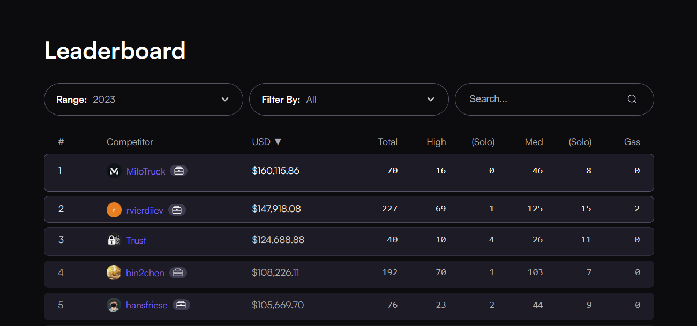

# MiloTruck's Portfolio

## About MiloTruck

I'm an independent security researcher and 1/4th of the team at [Renascence Labs](https://renascence-labs.xyz/). Currently, I'm a Security Researcher at [Spearbit](https://spearbit.com/) and Senior Auditor at [Trust Security](https://www.trust-security.xyz/).

For private audits or security consulting, please reach out to me on Twitter [*@milotruck*](https://twitter.com/milotruck).

### Highlights

- [Code4rena Profile](https://code4rena.com/@MiloTruck)
- [Blog: A year of Competitive Audits](https://milotruck.github.io/blog/A-year-of-Competitive-Audits/)
- Ranked #1 on Code4rena for 2023

## Engagements

### Renascence Labs

| Protocol | Category |  Report |
| - | - | :-: |
| [Redacted Finance](https://redacted.finance/) | Liquid ETH Staking | [📄](/engagements/renascence/Redacted%20Finance%20(Institutional%20Pirex).pdf) |
| [Redacted Finance](https://redacted.finance/) | Cross-chain Liquid Staking Token | [📄](/engagements/renascence/Redacted%20Finance%20(Branded%20LST).pdf) |
| [Arcade.xyz](https://www.arcade.xyz/) | NFT-collateralized Lending | [📄](/engagements/renascence/Arcade.xyz%20(V4).pdf) |
| [Arcade.xyz](https://www.arcade.xyz/) | Staking Rewards | [📄](/engagements/renascence/Arcade.xyz%20(ARCD%20Staking).pdf) |
| [Phuture Finance](https://www.phuture.finance/) | Multi-chain Index | [📄](/engagements/renascence/Phuture%20Finance%20(V2).pdf) |

### Spearbit

| Protocol | Category | Report |
| - | - | :-: |
| [Blast L2](https://blast.io/) | OP Stack | [📄](/engagements/spearbit/Blast%20L2.pdf) |
| [Sushiswap](https://www.sushi.com/) | AMM | [📄](/engagements/spearbit/Sushiswap%20(RouteProcessor4).pdf) |
| [Level Money](https://withstable.com/) | Synthetic Dollar | [📄](/engagements/spearbit/Level%20Money%20(Staking).pdf) |

### Trust Security

| Protocol | Category | Report |
| - | - | :-: |
| [Mozaic Finance](https://mozaic.finance/) | Yield Farming | [📄](/engagements/trust/Mozaic%20(Thesus%20Vault).pdf) |
| [Mozaic Finance](https://mozaic.finance/) | Staking Rewards | [📄](/engagements/trust/Mozaic%20(xMOZ%20Staking).pdf) |

## Private Audits

| Protocol | Category | Report |
| - | - | :-: |
| [Rodeo Finance](https://www.rodeofinance.xyz/) |  Yield Farming | [📄](/solo/Rodeo%20Finance%20(Camelot%20V3%20Strategy).pdf) | 
| [Rodeo Finance](https://www.rodeofinance.xyz/) |  Yield Farming | [📄](/solo/Rodeo%20Finance%20(GMX%20GM%20Strategy).pdf) | 
| [LUKSO](https://lukso.network/) |  ERC-20, ERC-721 | [📄](/solo/LUKSO%20(LSP4,%20LSP7,%20LSP8).pdf) |
| [LUKSO](https://lukso.network/) |  Account Abstraction | [📄](/solo/LUKSO%20(LSP0,%20LSP6).pdf) |

## Audit Contests

Reports for all audit contests can be found [here](/contests/).

| Contest | Category | Ranking | Report |
| - | - | :-: | :-: |
| [Arbitrum Security Council Elections](https://code4rena.com/contests/2023-08-arbitrum-security-council-election-system) | Governance, Voting | 🥇1st | [📄](/contests/pdf/Arbitrum%20Security%20Council%20Elections.pdf) |
| [Chainlink Staking v0.2](https://code4rena.com/contests/2023-08-chainlink-staking-v02) | Staking | 🥇1st |  |
| [YOLO Games](https://cantina.xyz/competitions/a2c3cc6a-e384-495f-9751-5d7e657bc219/leaderboard) | GameFi | 🥇1st |  |
| [Lens Protocol V2](https://code4rena.com/contests/2023-07-lens-protocol-v2) | Social Network | 🥇1st |[📄](/contests/2023-07-lens.md) |
| [StakeWise V3](https://app.hats.finance/audit-competitions/stakewise-0xd91cd6ed6c9a112fdc112b1a3c66e47697f522cd/leaderboard) | Liquid ETH Staking | 🥇1st |[📄](/contests/pdf/StakeWise%20V3.pdf) |
| [LUKSO](https://code4rena.com/contests/2023-06-lukso) | Blockchain Ecosystem, Account Abstraction | 🥇1st | [📄](/contests/pdf/LUKSO.pdf) |
| [Morpho Blue](https://cantina.xyz/competitions/d86b7f95-e574-4092-8ea2-78dcac2f54f1/leaderboard) | Lending | 🥈2nd | [📄](/contests/2023-12-morpho-blue.md) |
| [Wildcat](https://code4rena.com/contests/2023-10-the-wildcat-protocol) | Lending | 🥈2nd | [📄](/contests/2023-10-wildcat.md) |
| [Optimism Fault Proofs](https://audits.sherlock.xyz/contests/205/leaderboard) | OP Stack, Fault Proofs | 🥉3rd | |

## Bug Bounty

Immunefi

- [Beluga Protocol: Permanent freezing of tokens by vote manipulation](/immunefi/beluga-C-01.md) - Critical
- [Arcade.xyz: Forcing users into loans by manipulating EIP-1271 signatures](/immunefi/arcadexyz-H-01.md) - High
- [GYSR: Theft of funds through precision loss](/immunefi/gysr-I-01.md) - Informational

Others

- [Solmate: Edge-case in `wadMul()` of `SignedWadMath.sol`](https://github.com/transmissions11/solmate/pull/380)