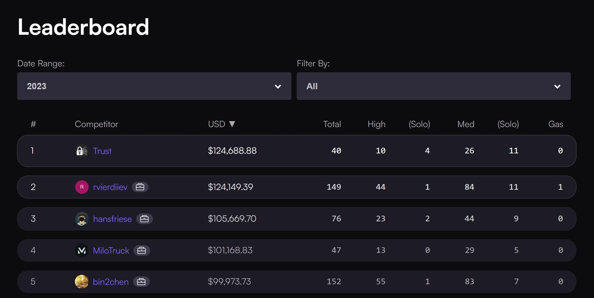

# MiloTruck's Audit Portfolio

## About MiloTruck

I'm an independent security researcher who specializes in smart contract audits. Currently, I work as a Senior Auditor at [Trust Security](https://www.trust-security.xyz/) and Associate Security Researcher at [Spearbit](https://spearbit.com/). Having won multiple audit contests, I'm also one of the top wardens on [Code4rena](https://code4rena.com/).

For private audits or security consulting, please reach out to me on:
- Twitter - [*@milotruck*](https://twitter.com/milotruck) 
- Discord - [*@milotruck*](https://discord.com/users/302259685560680460)

You can also request a quote on [Code4rena](https://code4rena.com/@milotruck) or [Cantina](https://cantina.xyz/u/milotruck) to engage them as an intermediary.

### Highlights

- [Code4rena Profile](https://code4rena.com/@MiloTruck)
- Ranked #4 on [Code4rena's 2023 leaderboard](https://code4rena.com/leaderboard)

## Private Audits

| Protocol | Type | Report |
| - | - | :-: |
| [LUKSO (LSP0, LSP6)](https://lukso.network/)  | Account Abstraction | [📄](/pdf/LUKSO%20Audit%20Report%202.pdf) |

## Audit Contests

Reports for all audit contests can be found [here](/audit-contests.md).

| Contest | Type | Ranking | Report |
| :-: | :-: | :-: | :-: |
| [LUKSO](https://code4rena.com/contests/2023-06-lukso) | Blockchain Ecosystem, Account Abstraction | 🥇1 / 22 | [📄](/pdf/LUKSO%20Audit%20Report.pdf) |
| [Lens Protocol V2](https://code4rena.com/contests/2023-07-lens-protocol-v2) | Social Network | 🥇1 / 26 |  |
| [Arbitrum Security Council Election System](https://code4rena.com/contests/2023-08-arbitrum-security-council-election-system) | Governance | 🥇1 / 38 | [📄](/pdf/Arbitrum%20Security%20Council%20Elections%20Audit%20Report.pdf) |
| [StakeWise V3](https://app.hats.finance/audit-competitions/stakewise-0xd91cd6ed6c9a112fdc112b1a3c66e47697f522cd/leaderboard) | Liquid ETH Staking | 🥇1 / 4 | [📄](/pdf/StakeWise%20V3%20Audit%20Report.pdf) |

## Bug Bounty

- [Beluga Protocol: Permanent freezing of tokens by vote manipulation](/immunefi/beluga-C-01.md) - Critical
- [Arcade.xyz: Forcing users into loans by manipulating EIP-1271 signatures](/immunefi/arcadexyz-H-01.md) - High
- [GYSR: Theft of funds through precision loss](/immunefi/gysr-I-01.md) - Informational