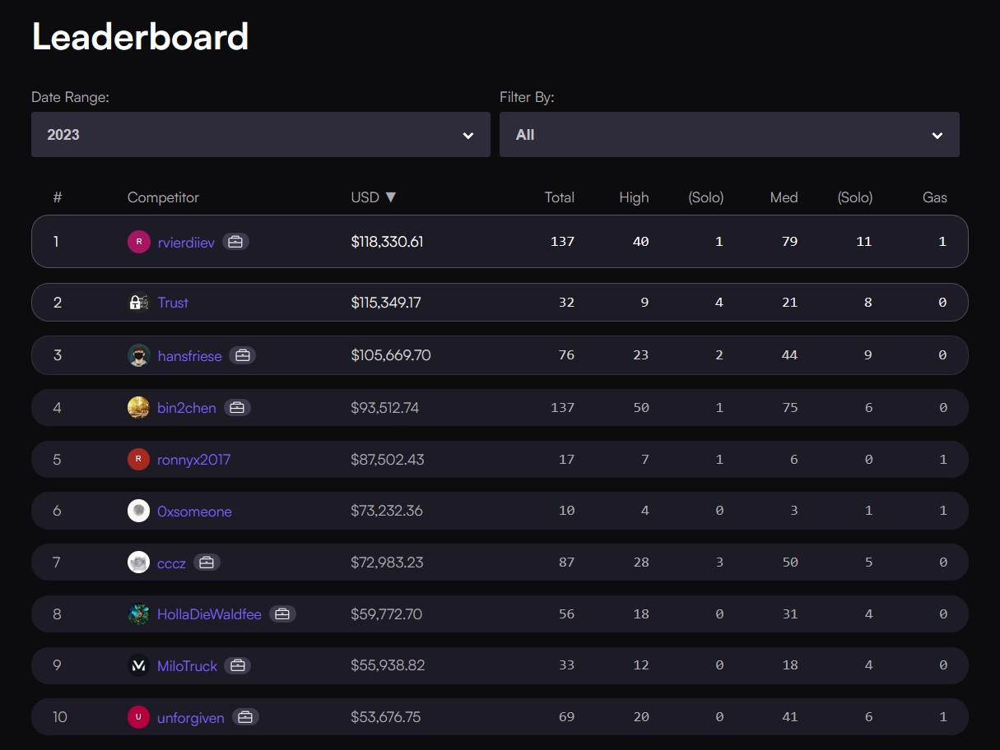

# MiloTruck's security audits and findings

This repository contains my portfolio of public security audits and bug bounty findings.

## Audit Contests

My reports and results for all audit contests I have participated in can be found [here](/audit-contests.md).

### Stats

- [Code4rena Profile](https://code4rena.com/@MiloTruck)
- 16 High, 39 Medium severity vulnerabilities found
- Ranked #9 on [Code4rena's 2023 leaderboard](https://code4rena.com/leaderboard)

### Highlights

- [LUKSO Network: Blockchain Ecosystem, Account Abstraction](/code4rena/2023-06-lukso.md) - 1st place
- [Chainlink CCIP: Cross-chain Messaging & Token Bridging]() - 8th place 
- [EigenLayer: Liquid Staking Derivative](/code4rena/2023-04-eigenlayer.md) - 9th place

## Bug Bounty

- [Beluga Protocol: Permanent freezing of tokens by vote manipulation](/immunefi/beluga-C-01.md) - Critical
- [GYSR: Theft of tokens through precision loss](/immunefi/gysr-I-01.md) - Informational

## Contacts

I am available for security consulting. Reach out to me on Twitter: [@milotruck](https://twitter.com/milotruck)